This is a Kotlin Multiplatform project targeting Android, Desktop (JVM).

## Run local server

This project uses a serverJVM module that launches a local server on localhost port 9090.

The server has two endpoints, GET /jsonlist and POST /jsonlist, which allow you to retrieve and save
a JSON string.

If you use Android Studio as your IDE, you can launch the server with the following command from the
Android Studio terminal.

```shell
 ./gradlew :serverJVM:run
```

This is launched with Gradle, so using Android Studio is the easiest way to get Gradle installed.

## Project Structure

This project is organized into three main modules, each with a specific responsibility:

```mermaid
graph TD
    %% Top-level modules
    A[serverJVM<br/>🖥️ Local Server]:::server
    B[composeApp<br/>📦 Main App]:::app
    C[common<br/>🧩 Shared Logic]:::common

    %% serverJVM description
    A -->|Exposes 2 endpoints<br/>Sync & Data| A1[API Endpoints]

    %% composeApp submodules
    B --> B1[jvmMain<br/>💻 Desktop App]
    B --> B2[androidMain<br/>📱 Android Test App]

    %% common submodules
    C --> C1[commonMain<br/>🧠 Shared Compose UI]
    C --> C2[androidMain<br/>🔧 Android-specific code]
    C --> C3[jvmMain<br/>🔧 JVM-specific code]

    %% dependencies
    B1 --> C
    B2 --> C

    %% Styling
    classDef server fill:#4B9CD3,stroke:#1E5A84,stroke-width:2px,color:white;
    classDef app fill:#9D60FB,stroke:#4B1E84,stroke-width:2px,color:white;
    classDef common fill:#F5A623,stroke:#C47F00,stroke-width:2px,color:black;
```



### 1. serverJVM

A local server module that exposes two endpoints:

One for synchronizing data

```shell
POST /jsonlist
```

One for retrieving data

```shell
GET /jsonlist
```

It serves as a lightweight backend for local testing and data exchange with the desktop and Android
apps.

### 2. composeApp

The main application module, containing the core logic and entry points for each platform.

#### 2.1 jvmMain

The source set for the desktop application, built using Compose for Desktop.

#### 2.2 androidMain

The source set for the Android test application, used mainly to preview and verify the UI components
on Android.
Although this could be a standalone Android project, it’s included here for simplicity and shared
development.

### 3. common

The shared logic module, responsible for building the cross-platform UI and shared domain layer.
This module is used by both `composeApp.jvmMain` and `composeApp.androidMain.

If needed, it can also be published as a library and reused in other projects.

#### 3.1 commonMain

Contains shared rendering logic, implemented with Compose Multiplatform, to create UI components
that work across all targets.

#### 3.2 androidMain

Holds Android-specific implementations, such as API calls or libraries that differ from the JVM
target.

#### 3.3 jvmMain

Contains JVM-specific implementations, similar to the Android ones, but using libraries or APIs
suited for the desktop environment.
